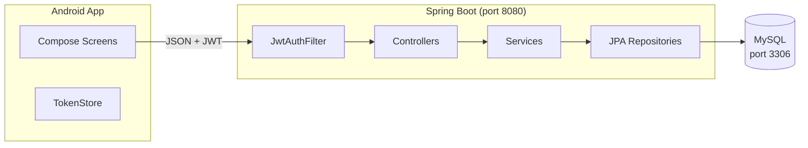
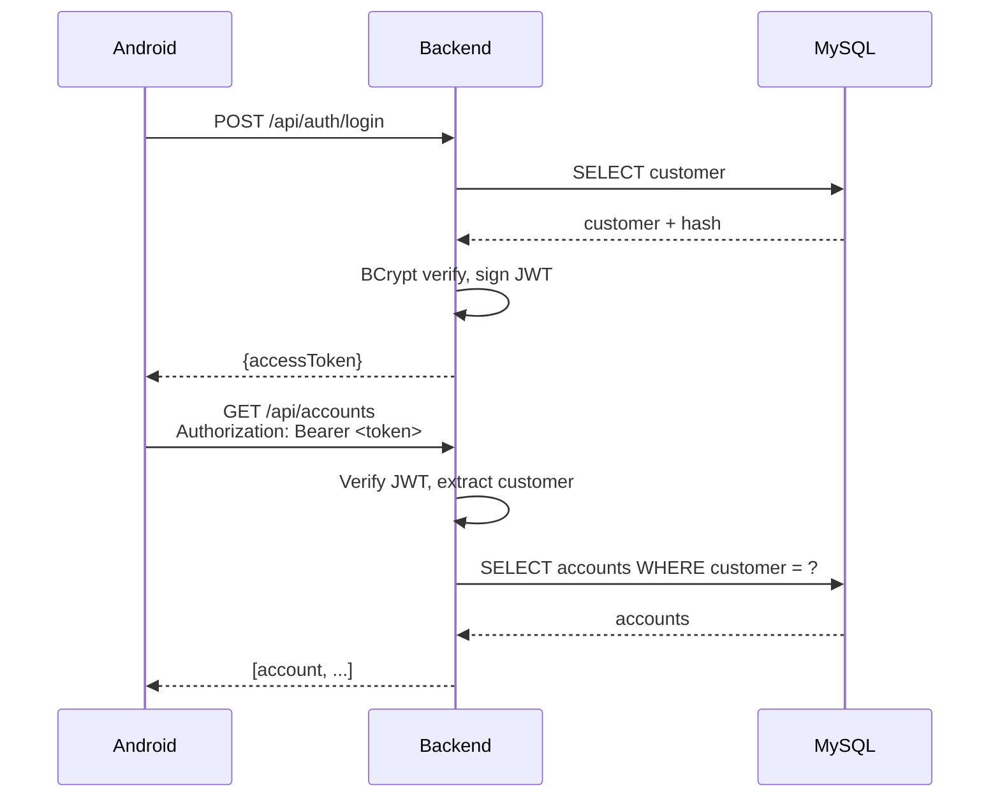
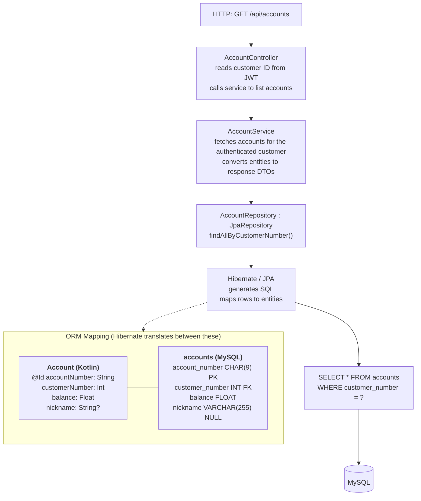

# Architecture

## Components

```mermaid
flowchart LR
    subgraph Phone["Android App"]
        UI[Compose Screens]
        TS[TokenStore]
    end

    subgraph Server["Spring Boot (port 8080)"]
        Filter[JwtAuthFilter]
        Ctrl[Controllers]
        Svc[Services]
        Repo[JPA Repositories]
        Filter --> Ctrl --> Svc --> Repo
    end

    DB[(MySQL<br/>port 3306)]

    UI -->|JSON + JWT| Filter
    Repo --> DB
```

## Login + Authenticated Request Flow

```mermaid
sequenceDiagram
    participant App as Android
    participant API as Backend
    participant DB as MySQL

    App->>API: POST /api/auth/login
    API->>DB: SELECT customer
    DB-->>API: customer + hash
    API->>API: BCrypt verify, sign JWT
    API-->>App: {accessToken}

    App->>API: GET /api/accounts<br/>Authorization: Bearer <token>
    API->>API: Verify JWT, extract customer
    API->>DB: SELECT accounts WHERE customer = ?
    DB-->>API: accounts
    API-->>App: [account, ...]
```

## Backend Layers + ORM Mapping

```mermaid
flowchart TB
    HTTP[HTTP: GET /api/accounts]
    Ctrl[AccountController<br/>reads customer ID from JWT<br/>calls service to list accounts]
    Svc[AccountService<br/>fetches accounts for the authenticated customer<br/>converts entities to response DTOs]
    Repo["AccountRepository : JpaRepository<br/>findAllByCustomerNumber()"]
    Hib[Hibernate / JPA<br/>generates SQL<br/>maps rows to entities]
    SQL[SELECT * FROM accounts<br/>WHERE customer_number = ?]
    DB[(MySQL)]

    HTTP --> Ctrl --> Svc --> Repo --> Hib --> SQL --> DB

    subgraph Mapping["ORM Mapping (Hibernate translates between these)"]
        direction LR
        Entity["<b>Account (Kotlin)</b><br/>@Id accountNumber: String<br/>customerNumber: Int<br/>balance: Float<br/>nickname: String?"]
        Table["<b>accounts (MySQL)</b><br/>account_number CHAR(9) PK<br/>customer_number INT FK<br/>balance FLOAT<br/>nickname VARCHAR(255) NULL"]
        Entity --- Table
    end

    Hib -.-> Mapping
```
